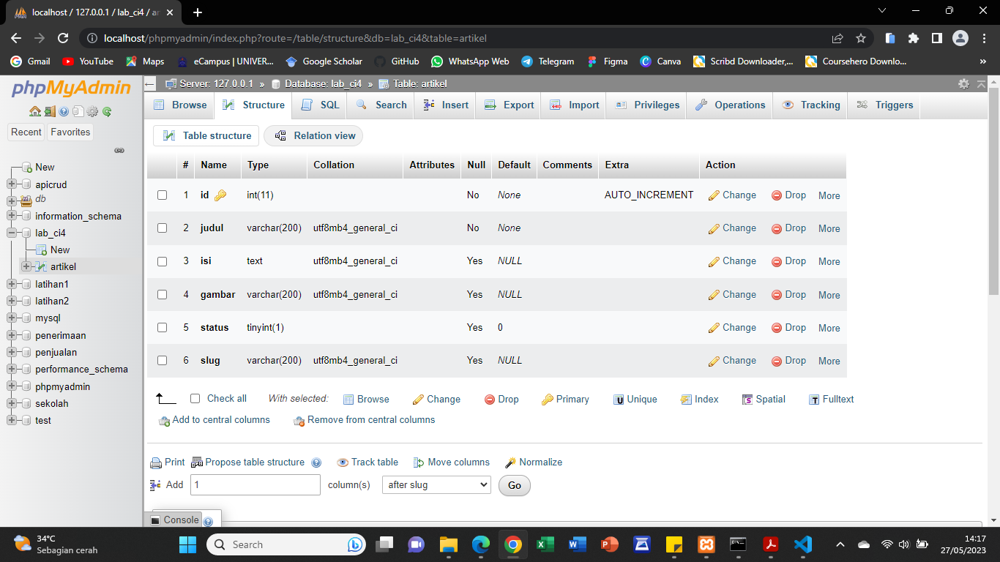
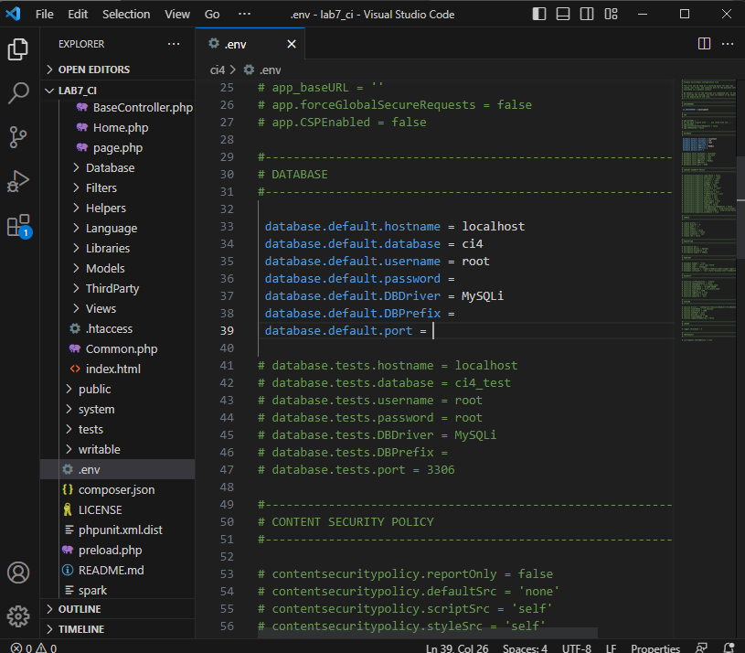
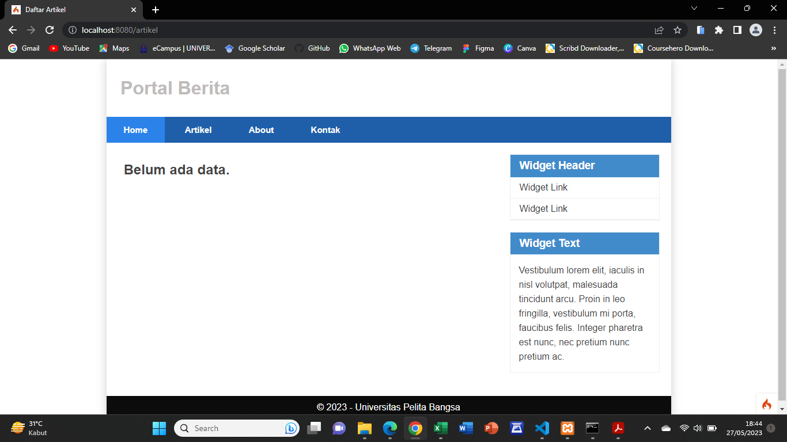
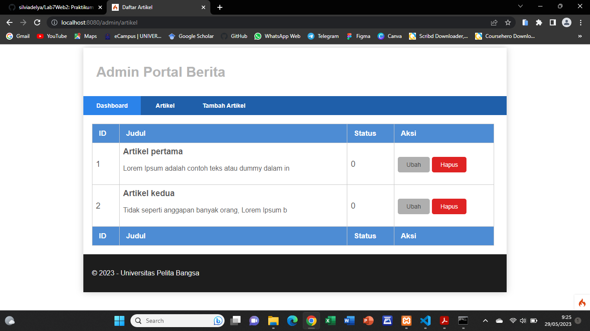
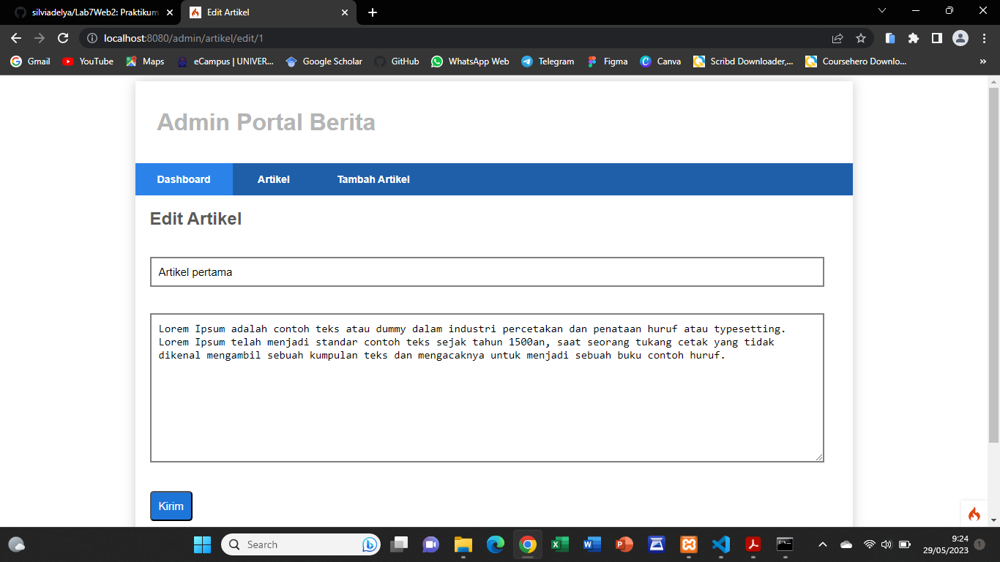

# Praktikum 8 - Framework Lanjutan (CRUD)

## Langkah-Langkah Praktikum

Untuk memulai membuat aplikasi CRUD sederhana, yang perlu disiapkan adalah database server menggunakan MySQL. Pastikan MySQL Server sudah dapat dijalankan melalui XAMPP.

## A. Membuat Database 

Buat database baru dengan nama **lab_ci4**.

```mySQL
    CREATE DATABASE lab_ci4; 
```

## B. Membuat Tabel

Setelah database berhasil dibuat, buat tabel baru dengan nama **artikel**.

```mySQL
    CREATE TABLE artikel (
        id INT(11) auto_increment,
        judul VARCHAR(200) NOT NULL,
        isi TEXT,
        gambar VARCHAR(200),
        status TINYINT(1) DEFAULT 0,
        slug VARCHAR(200),
        PRIMARY KEY(id)
    );
```




## C. Konfigurasi Koneksi Database

Konfigurasi dapat dilakukan dengan dua cara, yaitu pada file **app/config/database.php** atau menggunakan file **.env**. Pada praktikum ini kita gunakan konfigurasi pada file **.env**, kemudian hapus tanda **#** pada bagian database.




## D. Membuat Model

Selanjutnya membuat Model untuk memproses data Artikel. Buat file baru pada direktori **app/Models** dengan nama **ArtikelModel.php**.

```php
    <?php

    namespace App\Models;

    use CodeIgniter\Model;

    class ArtikelModel extends Model
    {
        protected $table = 'artikel';
        protected $primaryKey = 'id';
        protected $useAutoIncrement = true;
        protected $allowedFields = ['judul', 'isi', 'status', 'slug', 'gambar'];
    }
```

## E. Membuat Controller 

Buat Controller baru dengan nama **Artikel.php** pada direktori **app/Controllers.**

```php
    <?php

    namespace App\Controllers;

    use App\Models\ArtikelModel;

    class Artikel extends BaseController
    {
        public function index()
        {
            $title = 'Daftar Artikel';
            $model = new ArtikelModel();
            $artikel = $model->findAll();
            return view('artikel/index', compact('artikel', 'title'));
        }
    }
```

## F. Membuat View

1. Buat direktori baru dengan nama **artikel** pada direktori **app/views**, kemudian buat file baru dengan nama **index.php**.

```php
    <?= $this->include('template/header'); ?>

    <?php if($artikel): foreach($artikel as $row): ?>
    <article class="entry">
        <h2><a href="<?= base_url('/artikel/' . $row['slug']);?>"><?=$row['judul']; ?></a></h2>
        " alt="<?=$row['judul']; ?>">
        <p><?= substr($row['isi'], 0, 200); ?></p>
    </article>
    <hr class="divider" />
    <?php endforeach; else: ?>
    <article class="entry">
        <h2>Belum ada data.</h2>
    </article>
    <?php endif; ?>

    <?= $this->include('template/footer'); ?>
```

Selanjutnya buka browser kembali, dengan mengakses url http://localhost:8080/artikel




2. Kemudian tambahkan beberapa data pada database agar dapat ditampilkan datanya.

```mySQL
INSERT INTO artikel (judul, isi, slug) VALUE ('Artikel pertama', 'Lorem Ipsum adalah contoh teks atau dummy dalam industri percetakan dan penataan huruf atau typesetting. Lorem Ipsum telah menjadi standar contoh teks sejak tahun 1500an, saat seorang tukang cetak yang tidak dikenal mengambil sebuah kumpulan teks dan mengacaknya untuk menjadi sebuah buku contoh huruf.', 'artikel-pertama'), 
('Artikel kedua', 'Tidak seperti anggapan banyak orang, Lorem Ipsum bukanlah teks-teks yang diacak. Ia berakar dari sebuah naskah sastra latin klasik dari era 45 sebelum masehi, hingga bisa dipastikan usianya telah mencapai lebih dari 2000 tahun.', 'artikel-kedua');
```

## G. Membuat Tampilan Detail Artikel

Tampilan pada saat judul berita di klik maka akan diarahkan ke halaman yang berbeda. Tambahkan fungsi baru pada **Controllers/Artikel.php** dengan nama **view()**.

```php
    public function view($slug)
    {
        $model = new ArtikelModel();
        $artikel = $model->where(['slug' => $slug])->first();
        
        // Menampilkan error apabila data tidak ada.
        if (!$artikel)
        {
            throw PageNotFoundException::forPageNotFound();
        }
        $title = $artikel['judul'];
        return view('artikel/detail', compact('artikel', 'title'));
    }
```

## H. Membuat View Detail

Buat view baru untuk halaman detail dengan nama **app/views/artikel/detail.php**.

```php
    <?= $this->include('template/header'); ?>

    <article class="entry">
        <h2><?= $artikel['judul']; ?></h2>
        " alt="<?=$artikel['judul']; ?>">
        <p><?= $artikel['isi']; ?></p>
    </article>

    <?= $this->include('template/footer'); ?>
```

##  I. Membuat Routing untuk Artikel Detail

Buka Kembali file **app/config/Routes.php** kemudian tambahkan routing untuk artikel detail.

```php
    $routes->get('/artikel/(:any)', 'Artikel::view/$1');
```

## J. Membuat Menu Admin

1. Menu admin adalah untuk proses CRUD data artikel. Buat method baru pada **Controllers/Artikel.php** dengan nama **admin_index()**.

```php
    public function admin_index()
    {
        $title = 'Daftar Artikel';
        $model = new ArtikelModel();
        $artikel = $model->findAll();
        return view('artikel/admin_index', compact('artikel', 'title'));
    }
```

2. Selanjutnya buat view untuk tampilan admin dengan nama **admin_index.php** pada direktori **views/artikel**.

```php
    <?= $this->include('template/admin_header'); ?>

    <table class="table">
    <thead>
        <tr>
            <th>ID</th>
            <th>Judul</th>
            <th>Status</th>
            <th>Aksi</th>
        </tr>
    </thead>
    <tbody>
    <?php if($artikel): foreach($artikel as $row): ?>
    <tr>
        <td><?= $row['id']; ?></td>
        <td>
            <b><?= $row['judul']; ?></b>
            <p><small><?= substr($row['isi'], 0, 50); ?></small></p>
        </td>
        <td><?= $row['status']; ?></td>
        <td>
            <a class="btn" href="<?= base_url('/admin/artikel/edit/' .$row['id']);?>">Ubah</a>
            <a class="btn btn-danger" onclick="return confirm('Yakin menghapus data?');" href="<?= base_url('/admin/artikel/delete/' .$row['id']);?>">Hapus</a>
        </td>
    </tr>
    <?php endforeach; else: ?>
    <tr>
        <td colspan="4">Belum ada data.</td>
    </tr>
    <?php endif; ?>
    </tbody>
    <tfoot>
        <tr>
            <th>ID</th>
            <th>Judul</th>
            <th>Status</th>
            <th>Aksi</th>
        </tr>
    </tfoot>
    </table>

    <?= $this->include('template/admin_footer'); ?>
```

3. Tambahkan routing pada direktori **app/config** untuk menu admin seperti berikut:

```php
    $routes->group('admin', function($routes) {
    $routes->get('artikel', 'Artikel::admin_index');
    $routes->add('artikel/add', 'Artikel::add');
    $routes->add('artikel/edit/(:any)', 'Artikel::edit/$1');
    $routes->get('artikel/delete/(:any)', 'Artikel::delete/$1');
  });
```

4. Setelah itu buat **Template header** dan **footer** baru untuk **Halaman Admin**. Buat file baru dengan nama **admin_header.php** pada direktori **app/view/template**.

```html
    <!DOCTYPE html>
    <html lang="en">
    <head>
        <meta charset="UTF-8">
        <title><?= $title; ?></title>
        <link rel="stylesheet" href="<?= base_url('/admin.css');?>">
    </head>
    <body>
        <div id="container">
        <header>
        <h1>Admin Portal Berita</h1>
        </header>
    <nav>
    <a href="<?= base_url('/admin/artikel');?>" class="active">Dashboard</a>
        <a href="<?= base_url('/artikel');?>">Artikel</a>
        <a href="<?= base_url('/admin/artikel/add');?>">Tambah Artikel</a>
    </nav>
    <section id="wrapper">
        <section id="main">
```

5. Dan buat file baru lagi dengan nama **admin_footer.php** pada direktori **app/views/template**. 

```html
        <footer>
            <p>&copy; 2023 - Universitas Pelita Bangsa</p>
        </footer>
    </div>
    </body>
    </html>
```

6. Kemudian buat file baru lagi dengan nama **admin.css** pada direktori **ci4/public** untuk mempercantik tampilan **Halaman admin**.

7. Akses menu admin dengan URL: http://localhost:8080/admin/artikel, maka tampilannya akan seperti gambar dibawah.




## K. Menambah Data Artikel

1. Tambahkan fungsi/method baru pada **Controllers/Artikel.php** dengan nama **add()**.

```php
    public function add()
    {
        // validasi data.
        $validation = \Config\Services::validation();
        $validation->setRules(['judul' => 'required']);
        $isDataValid = $validation->withRequest($this->request)->run();
        
        if ($isDataValid)
        {
            $artikel = new ArtikelModel();
            $artikel->insert([
                'judul' => $this->request->getPost('judul'),
                'isi' => $this->request->getPost('isi'),
                'slug' => url_title($this->request->getPost('judul')),]);
            return redirect('admin/artikel');
        }
        $title = "Tambah Artikel";
        return view('artikel/form_add', compact('title'));
    }
```

2. Kemudian buat view untuk form tambah dengan nama **form_add.php** pada direktori **views/artikel**. 

```html
    <?= $this->include('template/admin_header'); ?>

    <h2><?= $title; ?></h2>
    <form action="" method="post">
    <p>
        <input type="text" name="judul">
    </p>
    <p>
        <textarea name="isi" cols="50" rows="10"></textarea>
    </p>
    <p><input type="submit" value="Kirim" class="btn btn-large"></p>
    </form>

    <?= $this->include('template/admin_footer'); ?>
```


## L. Mengubah Data

1. Tambahkan fungsi/method baru pada **Controllers/Artikel.php** dengan nama **edit()**.

```php
    public function edit($id)
    {
        $artikel = new ArtikelModel();

        // validasi data.
        $validation = \Config\Services::validation();
        $validation->setRules(['judul' => 'required']);
        $isDataValid = $validation->withRequest($this->request)->run();
        
        if ($isDataValid)
        {
            $artikel->update($id, [
                'judul' => $this->request->getPost('judul'),
                'isi' => $this->request->getPost('isi'),]);
            return redirect('admin/artikel');
        }

        // ambil data lama
        $data = $artikel->where('id', $id)->first();
        $title = "Edit Artikel";
        return view('artikel/form_edit', compact('title', 'data'));
    }
```

2. Kemudian buat view untuk form tambah dengan nama **form_edit.php** pada direktori **views/artikel**.

```html
    <?= $this->include('template/admin_header'); ?>

    <h2><?= $title; ?></h2>
    <form action="" method="post">
        <p><input type="text" name="judul" value="<?= $data['judul'];?>" ></p>
        <p><textarea name="isi" cols="50" rows="10"><?=$data['isi'];?></textarea></p>
        <p><input type="submit" value="Kirim" class="btn btn-large"></p>
    </form>

    <?= $this->include('template/admin_footer'); ?>
```

3. Kemudian klik **ubah** pada salah satu artikel.



## M. Menghapus Data

Tambahkan fungsi/method baru pada **Controllers Artikel** dengan nama **delete()**.

```php
public function delete($id)
    {
        $artikel = new ArtikelModel();
        $artikel->delete($id);
        return redirect('admin/artikel');
    }
```

## Terimakasih!